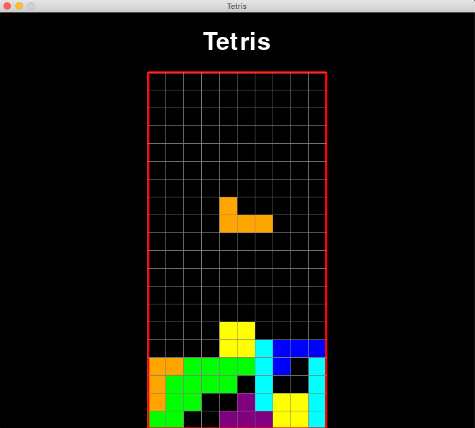

# Tetris-Python

In order to run this in mac make sure two have this 3 things:
- 1 python3 
- 2 use a virutal environment (I used virtualenv)
    * Make sure to be running a virutal environment before installing pygame (think of it as the json.package file)
    * to download and create a virtual environment:

        - pip3 install virtualenv
        - virtualenv <name_of_environment> /*(I name it venv)*/
        - souce venv/bin/activate

    https://uoa-eresearch.github.io/eresearch-cookbook/recipe/2014/11/26/python-virtual-env/

- 3 installing pygame with pip3
    
